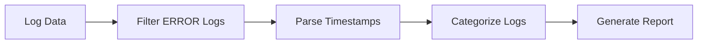

### 목차

- [서문](#서문)
- [파이프라인 아키텍처란](#파이프라인-아키텍처란)
- [파이프라인 아키텍처의 장점](#파이프라인-아키텍처의-장점)
- [Go로 파이프라인 구현하기](#go로-파이프라인-구현하기)
- [파이프와 필터](#파이프와-필터)
- [결론](#결론)

---

## 서문

파이프라인 아키텍처는 복잡한 데이터 처리를 위한 아키텍처 패턴 중 하나입니다. 파이프라인 아키텍처를 사용한
시스템은 다수의 필터로 구성되어 있으며 각 필터는 독립적으로 동작해서 데이터를 처리하고, 그 결과를 다음 필터로
파이프를 통해 전달합니다.

이런 파이프라인 아키텍처를 사용하는 프로그램에는 bash 쉘 스크립트가 대표적인 예시입니다.
이번 글에서는 파이프라인 아키텍처가 무엇인지, 어떤 장점을 가지고 있는지를 로그 데이터를 처리하는 예시를 통해
알아보겠습니다.

---

## 파이프라인 아키텍처란

파이프라인 아키텍처는 다수의 파이프와 필터로 구성됩니다. 데이터는 필터에서 연산을 수행하고, 그 결과는 다음 필터로
전달됩니다. 이 때 각 필터는 독립적으로 동작하며, 데이터를 처리하는 데 필요한 정보만을 가지고 있습니다. 이 때
필터간 데이터 전달은 파이프를 통해 이루어집니다.

예를 들어 로그 데이터를 처리하는 파이프라인을 구성해보겠습니다. 로그 데이터는 다음과 같은 필터를 거쳐 카테고리별로
집계된 리포트를 생성합니다.

1. 특정 심각도 수준의 로그만 필터링 (예: "ERROR" 로그)
2. 타임스탬프를 파싱하여 날짜 형식으로 변환
3. 로그를 카테고리별로 집계하여 리포트 생성
4. 리포트 출력



---

## 파이프라인 아키텍처의 장점

위의 로그 데이터를 처리하는 데 있어서 파이프라인 아키텍처는 복잡한 처리 단계를 필터를 통해 명확하게 분리해줍니다.
이를 통해 각 단계는 독립적으로 동작한다고 말할 수 있어 모듈성을 확보할 수 있습니다. 다시 말해, 새로운 필터나
변환 규칙을 추가하거나 수정할 때 다른 단계에 영향을 주지 않고 확장 가능합니다.

또한, 파이프라인 아키텍처는 병렬 처리를 통해 성능을 향상시킬 수 있습니다. 각 필터는 독립적으로 동작하기 때문에
병렬로 실행할 수 있습니다. 이를 통해 전체 처리 시간을 단축할 수 있습니다.

여기에 더해 각각의 필터는 독립적이므로 재사용하거나, 테스트를 수행하기도 용이합니다.

위와 같은 장점들 때문에 파이프라인 아키텍처는 데이터 처리, ETL(Extract, Transform, Load), 워크플로우 관리 등
복잡한 데이터 처리 시스템을 구현할 때 많이 사용됩니다.

---

## Go로 파이프라인 구현하기

다음 Go 코드는 위에서 설명한 로그 데이터 처리 파이프라인을 구현한 예시입니다. 파이프를 통해 처리될 데이터는
`Log` 구조체로 정의되어 있으며, 각 필터는 `Log` 구조체를 입력으로 받아 처리합니다. 각각의 데이터를 처리하는 단계는
로그 필터링, 타임스탬프 변환, 카테고리별 집계의 세 가지 단계로 명백하게 분리되어 있습니다. 이 때 각 단계는
독립적으로 동작하며, chan(채널)이라는 파이프를 통해 데이터를 전달합니다. 여기에 더해, 파이프라인 아키텍처의
장점 중 하나인 병렬 처리를 위해 Go 루틴을 사용하여 각 단계를 병렬로 실행하고 있습니다.

```go
package main

import (
    "fmt"
    "strings"
    "time"
)

// 로그 데이터 구조체
type Log struct {
    Timestamp string
    Category  string
    Severity  string
    Message   string
}

// Step 1: 특정 심각도 수준의 로그만 필터링 (예: "ERROR" 로그)
func filterBySeverity(input <-chan Log, severity string) <-chan Log {
    output := make(chan Log)
    go func() {
        defer close(output)
        for log := range input {
            if log.Severity == severity {
                output <- log
            }
        }
    }()
    return output
}

// Step 2: 타임스탬프를 파싱하여 날짜 형식으로 변환
func parseTimestamp(input <-chan Log) <-chan Log {
    output := make(chan Log)
    go func() {
        defer close(output)
        for log := range input {
            parsedTime, err := time.Parse("2006-01-02 15:04:05", log.Timestamp)
            if err == nil {
                log.Timestamp = parsedTime.Format("2006-01-02")
                output <- log
            } else {
                fmt.Println("타임스탬프 변환 실패:", err)
            }
        }
    }()
    return output
}

// Step 3: 로그를 카테고리별로 집계하여 리포트 생성
func aggregateByCategory(input <-chan Log) map[string]int {
    result := make(map[string]int)
    for log := range input {
        result[log.Category]++
    }
    return result
}

func main() {
    // 로그 데이터 샘플
    logs := []Log{
        {"2024-10-18 10:21:12", "Auth", "ERROR", "Failed login attempt"},
        {"2024-10-18 10:22:45", "Payment", "INFO", "Payment processed successfully"},
        {"2024-10-18 10:23:03", "Auth", "ERROR", "Invalid token"},
        {"2024-10-18 10:24:55", "Payment", "ERROR", "Payment gateway timeout"},
        {"2024-10-18 10:25:14", "Auth", "INFO", "User logged out"},
    }

    // Step 0: 입력 데이터를 생성하는 채널
    input := make(chan Log)
    go func() {
        defer close(input)
        for _, log := range logs {
            input <- log
        }
    }()

    // 파이프라인 구성
    filteredLogs := filterBySeverity(input, "ERROR")  // ERROR 로그만 필터링
    parsedLogs := parseTimestamp(filteredLogs)        // 타임스탬프를 날짜 형식으로 변환
    result := aggregateByCategory(parsedLogs)         // 로그를 카테고리별로 집계

    // 결과 출력
    fmt.Println("카테고리별 ERROR 로그 집계:")
    for category, count := range result {
        fmt.Printf("%s: %d\n", category, count)
    }
}
```

---

## 파이프와 필터

- 파이프
  - 데이터를 전달하는 매개체
  - 필터 간 데이터 전달을 담당
  - 단방향, 점대점 통신 방식
- 필터
  - 데이터를 처리하는 단위
  - 독립적으로 동작
  - 필요한 정보만을 가지고 있음
  - 파이프를 통해 데이터 전달

---

## 결론

파이프라인 아키텍처는 복잡한 데이터 처리를 위한 아키텍처 패턴 중 하나입니다. 각 필터는 독립적으로 동작하며,
파이프를 통해 데이터를 전달합니다. 이를 통해 복잡한 처리 단계를 명확하게 분리하고, 병렬 처리를 통해 성능을 향상시킬
수 있습니다. 또한, 각 필터는 독립적이므로 재사용하거나, 테스트를 수행하기도 용이합니다. 따라서 데이터 처리, ETL,
워크플로우 관리 등 복잡한 데이터 처리 시스템을 구현할 때 파이프라인 아키텍처를 사용하는 것이 좋습니다.
